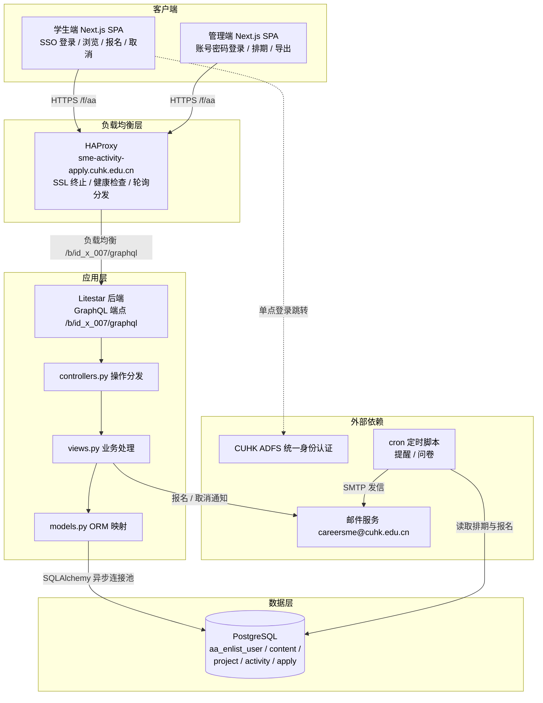
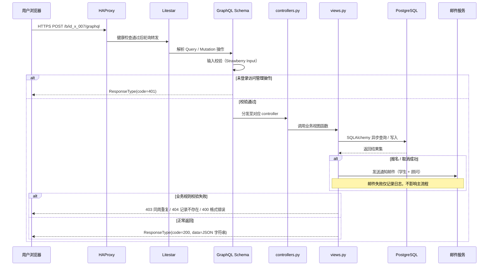

<div align="center">

# id_x_007: SME IAO 活动预约系统


</div>

**咨询主题发布 → 时段排期 → 人员预约 → 邮件提醒 → 取消与反馈 → 数据导出 的全流程预约闭环**

---

## 1. 简介 (Introduction)

- **Slogan**: 为经管学院「国际事务办公室」提供线上化的一对一咨询预约能力。
- **Description**: 本系统面向香港中文大学（深圳）经济管理学院「1v1咨询」预约平台，覆盖**咨询主题发布 → 时段排期 → 人员预约 → 邮件提醒 → 取消与反馈 → 数据汇总导出**的全流程闭环。学生侧将"找校友咨询"从邮件 / 微信沟通升级为自助式在线预约；管理侧将人工登记表升级为结构化数据，支持批量排期与一键导出；顾问侧通过邮件自动触达，无需登录即可掌握预约动态。系统采用前后端分离架构：后端基于 **Litestar** 异步框架，对外仅暴露单一 **GraphQL** 端点；前端基于 **React + Next.js + Tailwind CSS**，提供学生端与管理端两套布局；流量入口由 **HAProxy** 承担负载均衡与反向代理。

## 2. 核心特性 (Features)

- 双端分离：学生端（CUHK ADFS 单点登录，首次登录自动建档）与管理端（账号密码登录）共用同一站点、两套布局。
- 活动浏览：列表视图 + 日历视图（周/月/日切换），按 Open / Full / Closed 状态着色。
- 活动报名：结构化话题单选、已占用置灰、同 ISO 自然周唯一性校验、订单号（R+8位数字）自动生成。
- 管理后台：咨询项目维护（富文本、名额、顾问）、活动单条创建 / Excel 批量排期上传、报名明细查看。
- 数据导出：按时间区间 + 活动名多选导出 Excel，底部表格联动实时刷新报名明细。

## 3. 项目亮点 (Highlights)

1. **全流程业务闭环** —— 从主题发布、排期、报名、提醒、取消到反馈问卷与数据导出，一个系统覆盖预约业务全部环节，无需人工干预中间流程。
2. **单端点 GraphQL 契约** —— 全部业务经 `POST /b/id_x_007/graphql` 统一收发，Query / Mutation 强类型 Schema 描述，前后端以 `ResponseType(code, message, data)` 统一响应封装，接口演进无路径碎片化。
3. **定时邮件自动化** —— 三个 cron 脚本驱动顾问提醒（活动前一日 21:00）、学生提醒（活动前一日 21:00）、反馈问卷（活动结束满 2 小时，去重防重发），所有邮件统一由 `careersme@cuhk.edu.cn` 发出。
4. **精细业务规则** —— 同周限约 1 次、开始前 24 小时截止报名、结束前 4 小时禁取消、Open→Full→Closed 状态机自动流转，规则集中可审计。
5. **批量排期工程化** —— 提供 14 天 Excel 模板下载、填写上传，命中已有记录则更新、否则新增，上传后返回成功 / 失败计数。
6. **异步高性能后端** —— Litestar + SQLAlchemy 异步会话与连接池（pool_size=32、pool_recycle=360、pool_pre_ping），支撑大文件上传上限配置。
7. **负载均衡高可用** —— HAProxy 作为统一入口，承担 SSL 终止、健康检查与多实例后端轮询分发，支持无状态横向扩容。

## 4. 技术栈 (Tech Stack)

表 4-1 技术栈一览

| 分类 | 名称 | 版本 | 用途 |
|------|------|------|------|
| 编程语言 | Python / TypeScript | 3.11+ / 5.x | 后端服务 / 前端开发 |
| 后端框架 | Litestar | 2.x | 异步 Web 框架（GraphQL 单端点） |
| API 规范 | GraphQL（Strawberry） | — | Query / Mutation 强类型契约 |
| ORM | SQLAlchemy | 2.x | PostgreSQL 异步数据访问与连接池 |
| 数据处理 | pandas / openpyxl / xlsxwriter | 2.x / 3.x | 批量排期解析与报表导出 |
| 前端框架 | React / Next.js | 19 / 16 | 服务端渲染单页应用与路由 |
| 样式体系 | Tailwind CSS | 4.x | 原子化样式与主题变量 |
| 日历组件 | FullCalendar | 6.x | 学生端日历视图 |
| 富文本 | quill | 2.x | 项目内容编辑 |
| 构建工具 | Next.js（Turbopack） | — | 前端构建与类型检查 |
| 数据库 | PostgreSQL | 12+ | 业务数据存储（`aa_enlist_*` 表族） |
| 负载均衡 | HAProxy | 2.x | SSL 终止、健康检查、反向代理 |
| 运维组件 | Supervisor / cron | — | 进程守护、定时邮件 |

## 5. 整体架构图 (Overall Architecture Diagram)



## 6. 请求流转图 (Request Flow Diagram)



## 7. 目录结构 (Directory Structure)

```text
id_x_007/                         # 模型根目录
├── src/
│   ├── controllers/              # 控制层：GraphQL 操作分发
│   │   └── x_controllers.py      #   Query / Mutation 方法入口
│   ├── models/                   # ORM 层：SQLAlchemy 模型
│   │   └── x_models.py           #   aa_enlist_user/content/project/activity/apply
│   ├── schemas/                  # 契约层：Strawberry 类型定义
│   │   └── x_schemas.py          #   Input / ResponseType
│   └── views/                    # 视图层：业务逻辑与规则校验
│       └── x_views.py            #   报名 / 取消 / 排期 / 导出
├── scripts/
│   ├── send_reminder_mail_advisor.py   # 顾问提醒（每日 21:00）
│   ├── send_reminder_mail_student.py   # 学生提醒（每日 21:00）
│   └── send_question_mail.py           # 反馈问卷（每 2 小时）
├── utils/
│   ├── database_client.py        # 数据库配置加载（加密凭据解密）
│   ├── encrypt_util.py           # 加密工具
│   ├── decrypt_util.py           # 解密工具
│   └── log_util.py               # 日志工具
├── ops/
│   └── haproxy.cfg               # HAProxy 负载均衡配置
├── tools/
│   └── Supervisor/               # 进程守护配置
├── web/                          # 前端应用（Next.js + React + Tailwind CSS）
│   ├── src/
│   │   ├── api/                  # GraphQL 客户端封装（单端点 POST）
│   │   ├── app/                  # App Router 页面：登录、活动管理、项目管理、
│   │   │                         #   报表导出、学生首页、报名、我的记录、SSO 回调
│   │   ├── components/           # 组件：布局、日历、富文本、活动/项目表单
│   │   └── stores/               # 用户状态管理
│   ├── next.config.ts            # Next.js 构建配置
│   └── package.json              # 前端依赖清单
├── x_plugin.py                   # 插件入口：注册 GraphQL 路由 /b/id_x_007/graphql
└── requirements.txt              # Python 依赖清单
```

## 8. API 接口文档 (API Documentation)

- 统一端点：`POST https://<HOST>/b/id_x_007/graphql`
- 所有操作均为 GraphQL Query / Mutation；请求体 `{"query": "...", "variables": {"input": {...}}}`。
- 响应统一封装为 `ResponseType { code, message, data }`，`data` 为 JSON 字符串，需客户端二次解析。
- 管理操作需登录会话，未登录返回 `code=401`。

表 8-1 GraphQL 操作汇总

| 类型 | 操作名 | 说明 |
|------|--------|------|
| Mutation | login | 管理员账号密码登录 |
| Mutation | logout | 登出 |
| Query | get_user_activity_list | 学生端活动分页列表 |
| Query | search_user_activity | 活动筛选查询 |
| Mutation | apply_activity | 提交报名（同周唯一校验，403 重复） |
| Query | get_user_activity_detail | 活动详情（含话题占用状态） |
| Mutation | user_oauth | SSO 登录回调建档 |
| Mutation | cancel_apply | 取消报名（结束前 4 小时禁取消，404） |
| Query | fuzzy_activity_name | 活动名模糊搜索 |
| Query | get_project_list | 项目分页列表 |
| Mutation | create_project | 新增项目（name 唯一） |
| Mutation | update_project | 编辑项目 |
| Mutation | delete_project | 删除项目（级联删除活动与报名） |
| Query | search_project | 项目查询 |
| Query | search_project_owner | 顾问下拉查询 |
| Query | get_project_name_list | 项目名清单 |
| Query | get_activity_list | 活动分页列表 |
| Query | get_activity_detail | 单活动报名明细 |
| Mutation | create_activity | 新增活动 |
| Mutation | update_activity | 编辑活动 |
| Mutation | upload_activity | Excel 批量排期上传（.xlsx，400 格式错误） |
| Query | download_activity_template | 排期模板下载 |
| Query | export_activity | 报名数据 Excel 导出 |
| Query | search_activity | 活动查询 |
| Mutation | delete_activity | 删除活动（级联删除报名） |
| Query | get_activity_name_list | 活动名清单 |
| Query | fuzzy_export_activity_name | 导出活动名模糊搜索 |
| Query | search_query_title | 跨活动标题查询 |
| Query | search_query_data | 跨活动报名数据查询 |
| Query | download_query_data | 跨活动报名数据下载 |

调用示例（需替换 `<BASE_URL>` 与会话 Cookie）：

```bash
curl -X POST "<BASE_URL>/b/id_x_007/graphql" \
  -H "Content-Type: application/json" \
  -d '{
    "query": "mutation Login($input: LoginInput!) { login(input: $input) { code message data } }",
    "variables": {"input": {"username": "<USERNAME>", "password": "<PASSWORD>"}}
  }'

curl -X POST "<BASE_URL>/b/id_x_007/graphql" \
  -H "Content-Type: application/json" \
  -H "Cookie: <SESSION_COOKIE>" \
  -d '{
    "query": "mutation Apply($input: ApplyInput!) { apply_activity(input: $input) { code message data } }",
    "variables": {"input": {"activity_id": "<ID>", "info_1": "<咨询话题>"}}
  }'
```

## 9. 快速部署 (Quick Deploy)

### 环境准备 (Prerequisites)

- Python 3.11+（建议 conda 虚拟环境）
- Node.js 20+ 与 npm
- PostgreSQL 12+
- HAProxy、Supervisor、cron（生产环境）

### 安装 (Installation)

```bash
# 后端依赖
cd id_x_007
pip install -r requirements.txt

# 前端依赖
cd web
npm install
```

### 运行 (Run)

```bash
# 后端（GraphQL 端点 /b/id_x_007/graphql，数据库凭据经环境变量加密注入）
python x_plugin.py

# 前端开发
cd web
npm run dev

# 前端生产构建
npm run build
```

### 生产部署 (可选)

- **Supervisor**：使用 `tools/Supervisor/` 下配置守护后端进程（含 `DB_HOST` / `DB_PORT` / `DB_USERNAME` / `DB_PASSWORD` 加密环境变量）。
- **HAProxy**：使用 `ops/haproxy.cfg`，前端产物由 Next.js 服务承载，域名 `sme-activity-apply.cuhk.edu.cn` 统一入口，SSL 终止于 HAProxy；`/b/id_x_007/graphql` 经健康检查（`option httpchk`）后轮询分发至多个后端实例，示例：

```text
frontend sme_aa
    bind *:443 ssl crt /etc/haproxy/certs/cuhk-edu-cn.pem
    default_backend litestar_nodes

backend litestar_nodes
    balance roundrobin
    option httpchk GET /b/id_x_007/health
    server node1 127.0.0.1:8101 check
    server node2 127.0.0.1:8102 check
```

- **cron**：配置三个邮件脚本定时任务：

```text
0 21 * * *  python scripts/send_reminder_mail_advisor.py
0 21 * * *  python scripts/send_reminder_mail_student.py
0 */2 * * * python scripts/send_question_mail.py
```
